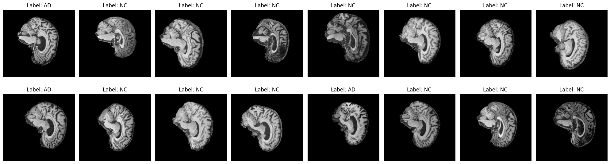

# Classify Alzheimer’s disease (normal and AD) of the ADNI brain data using Convolutional Vision Transformer (CvT)

This project aims to classify Alzheimer's disease (normal vs. AD) using the Convolutional Vision Transformer (CvT) on ADNI brain data.

## Reproducibility
To reproduce this results used in this README.md file, this is the library that should be installed:

```
Python : 3.12.4
torch : 2.4.0+cu118
torchvision : 0.19.0+cu118
numpy : 1.26.3
matplotlib : 3.9.2
```

Then, open the dataset.py and change the path of the dataset if needed, currently it is:
```Python
# server path
train_path_server = '/home/groups/comp3710/ADNI/AD_NC/train/'
test_path_server = '/home/groups/comp3710/ADNI/AD_NC/test/'
```
The next step, from the terminal:
```
python train.py
```
It will reproduce all of the results related to the training model and the results of the testing data.
Moreover, to use the model created from the training model, from the terminal:
```
python predict.py
```
It will predict the label/class of the 1 inputted image.

## Convolutional Vision Transformer
The Convolutional Vision Transformer (CvT) improves the Vision Transformer by:

- Convolutional Token Embedding: This layer uses convolutions to create detailed, overlapping patches from images, reducing the number of tokens while capturing more detail, similar to CNNs, without needing position embeddings.

- Convolutional Transformer Blocks: These blocks use depth-wise separable convolutions to process queries, keys, and values in the attention mechanism, making it more efficient than traditional transformers.

CvT adds a classification token at the final stage, with a fully connected layer for class prediction, offering efficiency while capturing rich image features. [Wu et al., 2021].

Below is a visualization of the Convolutional Transformer Block, which includes the convolution projection as the first layer.


[Wu et al., 2021]

## ADNI brain data
The ADNI dataset is an extensive and widely utilized resource that includes longitudinal data across multiple domains such as clinical, imaging, genetic, and biomarker information. It contains diverse data types, including structural, functional, and molecular brain imaging, biofluid biomarkers, cognitive evaluations, genetic data, and demographic details (Alzheimer's Disease Neuroimaging Initiative, n.d.).

This dataset contains two classes which are Normal Control (NC) and Alzheimer's disease (AD). In addition, this dataset contains:

Training data:
- NC: 11120
- AD: 10400

Testing data:
- NC: 4540
- AD: 4460

## Preprocessing
To do the classification of the ADNI brain data, it needs to prepare the training, validation, and test data. Here, it splits the original training data into training and validation data by 80:20 respectively. Therefore, the number of the dataset for doing the classification is:

Training data:
- NC: 8943
- AD: 8273

Validation data:
- NC: 2177
- AD: 2127

Testing data:
- NC: 4540
- AD: 4460

This is the sample of the training dataset:


This is the sample of the testing dataset:


Furthermore, the training and validation data is augmented to expand and diversify a dataset by applying different transformations to the original data. This technique enhances the performance and generalization ability of models. This is the process of data augmentaion applied:

```Python
# tranformation and data augmentation for training data
transform = transforms.Compose([
        transforms.Resize((224, 224)),
        transforms.RandomHorizontalFlip(),
        transforms.RandomRotation(20),
        transforms.CenterCrop(128),
        transforms.ToTensor(),
        transforms.Normalize(mean=[0.1155, 0.1155, 0.1155], std=[0.2224, 0.2224, 0.2224])
    ])

# transformation and data augmentation for testing data
transform_test = transforms.Compose([
    transforms.Resize(224),
    transforms.CenterCrop(128),
    transforms.ToTensor(),
    transforms.Normalize(mean=[0.1155, 0.1155, 0.1155], std=[0.2224, 0.2224, 0.2224])
])
```
The value of mean and the standard deviation for normalization is got from the direct calculation on the dataset. In addition, the center crop is applied to the test data because of to make the image clearer when inputting to the model. These are the data after data augmentation:

This is the sample of the training dataset after augmentation:


This is the sample of the testing dataset after augmentation:


## Hyperparameter and Training Processes
In the modules.py, this is the hyperparameter used for the model:
```Python
CONV_EMBEDDING_INPUT_CHANNELS=3
CONV_EMBEDDING_DIM=64
CONV_EMBEDDING_KERNEL_SIZE=7
CONV_EMBEDDING_STRIDE=4
CONV_EMBEDDING_PADDING_SIZE=2
TRANSFORMER_BLOCK_DROPOUT=0.1

CVT_INPUT_CHANNELS=3
CVT_CLASS_COUNT=2
CVT_EMBEDDING_DIM=32
CVT_HEAD_COUNT=8
CVT_HIDDEN_DIM=128
CVT_TRANSFORMER_BLOCK_COUNT=4
CVT_DROPOUT=0.3
```

Moreover, for training the model:
```
NUM_EPOCHS = 100
EARLY_STOPPING_PATIENCE = 10
OPTIMIZER_LEARNING_RATE = 1e-3
SCHEDULER_STEP_SIZE = 10
SCHEDULER_GAMMA = 0.1
```
Where the details are:
- Loss Function: Cross Entropy
- Optimizer: ADAM (Adaptive Moment Estimation)
- Scheduler: StepLR

### Early Stopping Mechanism

Early stopping prevents overfitting by monitoring validation loss during training. If the loss doesn’t improve for 10 consecutive epochs, training stops automatically. Therefore, the model stops learning when it’s no longer improving, helping it generalize better to new data.

## Results
After training for the number of epochs = 100, the early stopping mechanism is triggered at the 43th epochs by resulting:
```
Training loss: 0.5282
Validation loss: 0.5231
Training accuracy: 73.3794%
Validation accuracy: 74.1171%
```
Full output can be accesed on the path of this repository:
```
results/train002_a100.out
```
These are the visualization of the loss and accuracy from the training and validation data:


From the results, it looks like the model is learning shown by the decrease of the training and validation loss and end up convergence to certain value. Moreover, the training and validation accuracy also increase as the number of epochs increase showing the positive trends of the training processes.

After that, it uses test data to evaluate the accuracy, and the results is:
```
Test accuracy: 66.25555555555556
```

Surprisingly, the accuracy of the test data is only 66.26% which is lower than the accuracy from the validation data indicating that the model is slightly overfitting.

After saving the model as:
```
cvt_model.pth
```
The process of prediction is by picking one of the image from the test data and the class of AD which is:
```
AD/1254307_109.jpeg
```
It results:
```
Labels corresponding to the images (0 for NC, 1 for AD)
Ground truth class: AD
Predicted class: 1
Correct predictions!
```
From the prediction results above, it shows that the model is capable to classify the sample AD image.

## Conclusion
Convolutional Vision Transformer can be used to perform the image classification on the ADNI brain data. However, it needs further improvement in this architecture to improve the generalization and robustness of the model because the accuracy of the test data (66.26%) is lower than the accuracy of the validation (74.1%) data indicating slight overfitting from this experiment.

## Future Improvements
This model has had some initial hyperparameter tuning, but further adjustments can improve its generalization. Key improvements include:
- trying different methods of data augmentation to make the model more adaptable
- running more epochs such as 200-300 to allow the model capture more patterns in the data
- adding minimum number to trigger early stopping mechanism
- increasing CvT model depth such as by adding the number of transformer blocks or layers to capture more complex representations.

## References
- Alzheimer's Disease Neuroimaging Initiative. (n.d.). ADNI data. Retrieved October 22, 2024, from https://adni.loni.usc.edu/data-samples/adni-data/
- Wu, H., Xiao, B., Codella, N., Liu, M., Dai, X., Yuan, L., & Zhang, L. (2021). CvT: Introducing Convolutions to Vision Transformers. *CoRR*, abs/2103.15808. Available at: [https://arxiv.org/abs/2103.15808](https://arxiv.org/abs/2103.15808).


